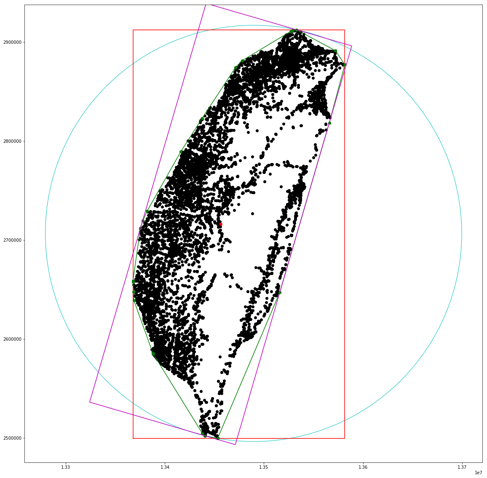

# ShapeAnalyzer
Shape Analysis Library, no third part library, pure in python.

## Tools
* basic shapes: Point, LineSegment, Line, Circle, Rectangle, LineString, Polygon
* bounding geometry: envelope, convex hull, minimum area enclosing circle, minimum width enclosing rectangle
* shape descriptors: area, perimeter, roundness, curvature, circularity

## Examples
a testing examples in [test.ipynb](test.ipynb). go to the directory and `jupytor notebook`. You need `jupytor` and `numpy` to run examples
* Bounding Geometry


* Shape Descriptors
```python
from shapeanalyzer.descriptors import ShapeDescriptor
import json
SD = ShapeDescriptor(Polygon(hull))
print json.dumps(SD.Descriptors(), indent=2)
```
```json
{
  "Perimeter": 965409.9950867649, 
  "Circularity": 0.342781478251589, 
  "Area": 47611201206.578125, 
  "Convesness": 1.0, 
  "Curvature": 0.3652330296191309, 
  "Roundness": 0.641941453101358
}
```
